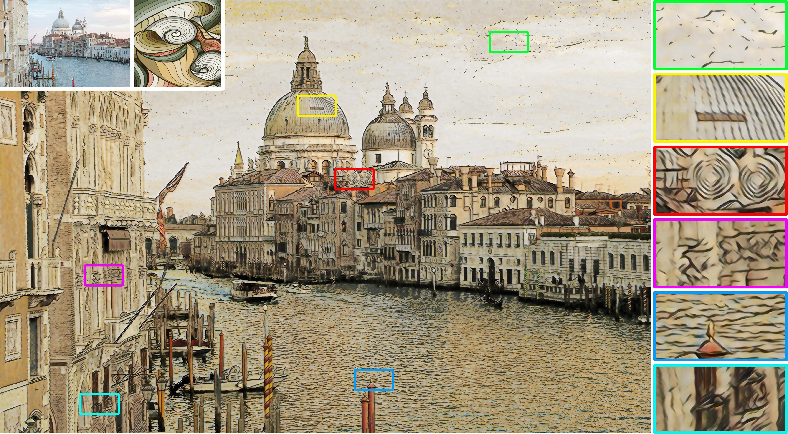
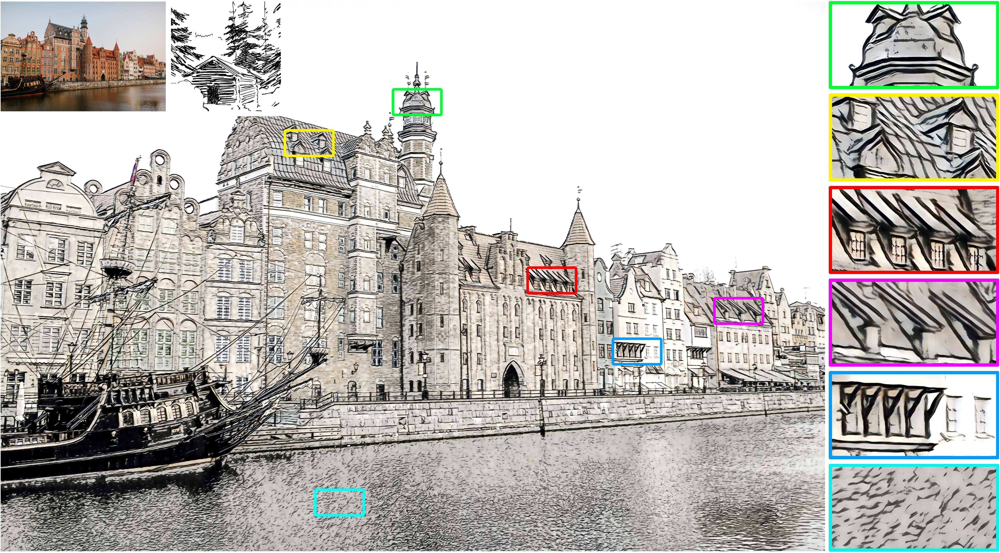

# Huang2017AdaIN

This is a PyTorch implementation for the paper "[Arbitrary Style Transfer in Real-time with Adaptive Instance Normalization](https://arxiv.org/abs/1703.06868)", which comes from the repository [pytorch-AdaIN](https://github.com/naoto0804/pytorch-AdaIN).

## Ultra-high Resolution Stylized Results

### Example 1

<center></center>

```shell
CUDA_VISIBLE_DEVICES=<gpu_id> python test.py --content ../examples/content/pexels-andrea-piacquadio-3830880.jpg \
                                             --style ../examples/style/line2.png \
                                             --decoder models/decoder_stroke_perceptual_loss_1.pth.tar \
                                             --URST
```

### Example 2

<center></center>

```shell
CUDA_VISIBLE_DEVICES=<gpu_id> python test.py --content ../examples/content/pexels-julia-volk-5273641.jpg \
                                             --style ../examples/style/81575.jpg \
                                             --decoder models/decoder_stroke_perceptual_loss_1.pth.tar \
                                             --URST
```

## Test (Ultra-high Resolution Style Transfer)

Use `--content` and `--style` to provide the respective path to the content and style image.
```shell
CUDA_VISIBLE_DEVICES=<gpu_id> python test.py --content <content_path> \
                                             --style <style_path> \
                                             --decoder <decoder_path> \
                                             --URST
```

Some options:
* `--patch_size`: The maximum size of each patch. The default setting is 1000.
* `--style_size`: The size of the style image. The default setting is 1024.
* `--thumb_size`: The size of the thumbnail image. The default setting is 1024.
* `--decoder`: Path to the decoder. The default decoder is the original model trained without our stroke perceptual loss. 
* `--URST`: Use our URST framework to process ultra-high resolution images.
* `--alpha`: Adjust the degree of stylization. It should be a value between 0.0 and 1.0 (default).
* `--preserve_color`: Preserve the color of the content image.

## Train (Enlarge the Stroke Size)

Use `--content_dir` and `--style_dir` to provide the respective directory to the content and style images.
```shell
CUDA_VISIBLE_DEVICES=<gpu_id> python trainv2.py --content_dir <coco_path> --style_dir <wikiart_path>
```

For more details and parameters, please refer to `--help` option.
