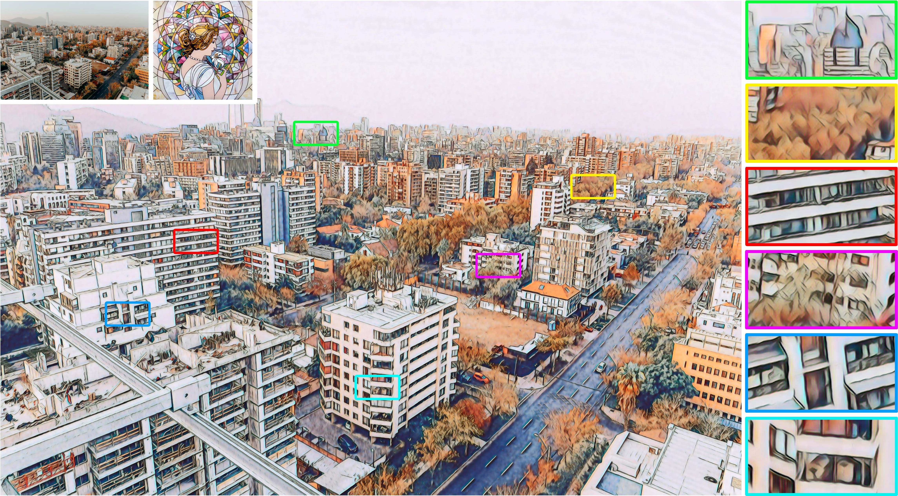

## Li2018Learning
This is a PyTorch implementation for the paper "[Learning Linear Transformations for Fast Image and Video Style Transfer](http://openaccess.thecvf.com/content_CVPR_2019/papers/Li_Learning_Linear_Transformations_for_Fast_Image_and_Video_Style_Transfer_CVPR_2019_paper.pdf)", which comes from the repository [LinearStyleTransfer](https://github.com/sunshineatnoon/LinearStyleTransfer).

## Ultra-high Resolution Stylized Result

<center></center>
<p align="center">
  One ultra-high resolution stylized result of 12000 x 8000 pixels (i.e., 96 megapixels).
</p>


```shell
CUDA_VISIBLE_DEVICES=<gpu_id> python test.py --content ../examples/content/pexels-alisha-lubben-2305747.jpg \
                                             --style ../examples/style/mosaic.png \
                                             --decoder models/dec_r41_stroke_perceptual_loss_1.pth \
                                             --URST
```

## Test (Ultra-high Resolution Style Transfer)

Use `--content` and `--style` to provide the respective path to the content and style image.

```shell
CUDA_VISIBLE_DEVICES=<gpu_id> python test.py --content <content_path> \
                                             --style <style_path> \
                                             --decoder <decoder_path> \
                                             --URST
```

Some options:

* `--patch_size`: The maximum size of each patch. The default setting is 1000.
* `--style_size`: The size of the style image. The default setting is 1024.
* `--thumb_size`: The size of the thumbnail image. The default setting is 1024.
* `--decoder`: Path to the decoder. The default decoder is the original model trained without our stroke perceptual loss. 
* `--URST`: Use our URST framework to process ultra-high resolution images.

## Train (Enlarge the Stroke Size)

Use `--contentPath` and `--stylePath` to provide the respective directory to the content and style images.

```shell
CUDA_VISIBLE_DEVICES=<gpu_id> python trainv2.py --contentPath <coco_path> --stylePath <wikiart_path>
```

For more details and parameters, please refer to `--help` option.